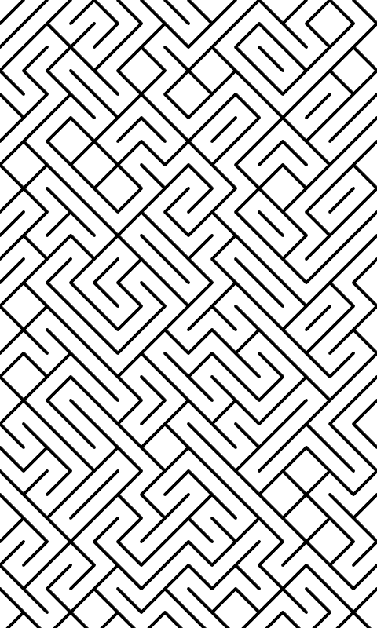

# Inksomnia

A collection of p5.js sketches for generating sleep-screen artwork for an XTeink X4 e-ink reader.

## Usage
- Go to https://joshkaspar.github.io/inksomnia
- Load a script from the dropdown menu 
  - `R` to regenerate
  - `S` to save a BMP

## Alternate
- These scripts will also run at https://editor.p5js.org/

## Examples

### Smith tiles

### 10 PRINT

### 10 PRINT Lines

### Arc tiles

### Diagonal tiles

### Train Tracks

